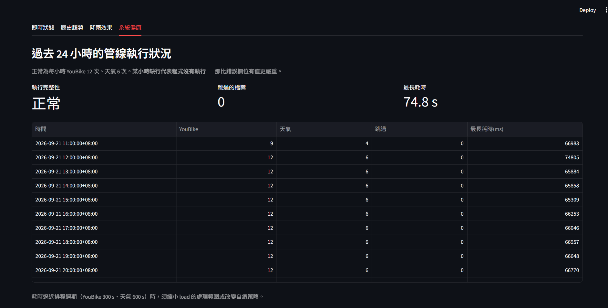

# YouBike × 天氣：即時資料管線與降雨效果的因果分析

每 5 分鐘抓取臺北市 YouBike 2.0 全站狀態、每 10 分鐘抓取中央氣象署觀測，
落地為 raw JSON 後寫入 PostgreSQL，用於估計降雨對單車使用量的因果效果。

**系統自 2026-08-17 起部署於 AWS EC2，連續運行中。**

---

## 架構

```
YouBike 2.0 API ──┐
                  │  cron */5   fetch.py ──→ data/raw/*.json ──┐
                  │                                             │
中央氣象署 O-A0002 ┤                                             ├──→ PostgreSQL
（雨量，71 測站）  │  cron */10  fetch_weather.py ──→            │    (Docker on EC2)
中央氣象署 O-A0003 ┘                data/weather/*.json ────────┘         │
（綜觀，9 測站）                            ▲                             │
                                cron 04:00  gzip（兩天前的檔案）          │
                                                                    SSH tunnel
                                                                         │
                                               本機  Streamlit 儀表板 ／ Jupyter 分析
```

抓取與入庫分離：`fetch.py` 只負責取得與落地，抓完再呼叫 `load.py`。
資料庫故障時 raw 檔案仍完整保留，恢復後由「每次處理最近 100 個檔案」自動補齊。

每次執行皆寫入 `fetch_log` / `load_log`，記錄耗時、處理檔數、跳過檔數與錯誤訊息。

---

## 資料規模

| 項目 | 數量 |
|---|---|
| YouBike 站點 | 1,795 |
| 氣象測站（臺北市／全臺） | 71 / 1,342 |
| 抓取頻率 | YouBike 每 5 分鐘、天氣每 10 分鐘 |
| 連續運行 | 自 2026-08-17 21:05 |

---

## 技術棧

Python 3 · PostgreSQL 16 · Docker · AWS EC2 · cron · psycopg 3 · pandas · linearmodels · Streamlit

---

## 三個關鍵設計決策

完整的 14 條決策與理由見 [`docs/schema_design.md`](docs/schema_design.md)。

### 1. 主鍵用 `(sno, info_time)`，不用 `(sno, fetched_at)`

觀測到有站點失聯超過一年半（`infoTime` = 2025-02-27），但 API 仍每次照常回傳，
外觀與正常站無異。

| 主鍵選擇 | 該站 288 次抓取後的列數 |
|---|---|
| `(sno, info_time)` | **1 列** |
| `(sno, fetched_at)` | 288 列 |

用資料本身的時間戳當主鍵，同時解決兩件事：重複抓取天然冪等，
且失聯站不會產生 288 筆/天標著今日時間卻是舊值的假紀錄——
那會在建模時形成一條完全靜止的偽時間序列。

代價是丟失「我在某時刻確實抓到這站」的資訊，以 `last_fetched_at` 欄位補回。

> ⚠️ **資料源行為變更（2026-08-29 起）**
>
> 此決策的前提是「`infoTime` 僅在該站數值實際更新時改變」。
> 觀測期內該前提變化了兩次：
>
> | 期間 | 行為 | 日均寫入 |
> |---|---|---|
> | 8/17–8/28 | 正常 | 約 20 萬 |
> | 8/29–8/30 | 大量站點回報停滯 | 1.5 萬 |
> | 8/31 起 | `infoTime` 改為每次回應皆給當下時間 | 51.8 萬（= 1,800 × 288） |
>
> 第二階段的診斷：檢查 8/29 12:00 的 raw 檔案，1,798 個站中有 468 站的
> `infoTime` 停在 01 時、207 站停在 00 時，僅 371 站是當下的 11 時。
> **本設計在此階段運作正常**——沒有新資料就不產生新列，
> 日均寫入量的下降忠實反映了資料源的停滯，而非系統故障。
> 若當初選擇 `(sno, fetched_at)`，那兩天照樣會是 20 萬筆漂亮的紀錄，
> **根本不會發現資料源出了問題**。
>
> 第三階段起「天然冪等」仍成立（同一檔案重複處理不產生重複列），
> 但「不產生假紀錄」失效：失聯逾一年半的東門站開始每天產生 288 筆
> 標著今日時間的假紀錄。失聯偵測需改以「數值連續不變」判定，已排入待處理。
>
> 本文的分析結果使用 8/20–8/28 的資料，在行為變更之前。

### 2. 資料延遲與處理延遲必須分開記錄

初版用 `now()` 填 `last_fetched_at`，測試時查出「全部 1,784 站皆 stale」。
實際原因是該欄混入了檔案躺在硬碟上的處理延遲。

| 算式 | 意義 | 影響 |
|---|---|---|
| `last_fetched_at - info_time` | 資料延遲：該站多久沒回報 | 分析正確性 |
| `loaded_at - last_fetched_at` | 處理延遲：檔案多久才入庫 | 系統健康監控 |

改為 `fetched_at` 由檔名解析、`loaded_at` 用 `now()`。
若壓成單一數字，load 中斷後補跑會使該區間的資料延遲虛增，
而且**無法從資料中看出**——以延遲門檻篩選樣本時會誤刪一批完好的觀測。

### 3. 降雨與溫度使用不同的空間對應

臺北市 71 個雨量站中，僅 9 站具完整氣象儀器。
以「所有低海拔測站」為候選做最近配對時，多數站點會被配到只有雨量筒的測站
——實測分析樣本的溫度缺失率達 **100%**。

拆成兩張對應表，依據是兩種要素的空間尺度不同：

| 要素 | 空間變異 | 測站數 | 平均配對距離 |
|---|---|---|---|
| 降雨 | 大（對流性降雨可隔一公里就沒了） | 50 | 873 m |
| 溫度 | 小（都會平地間差異主要來自海拔） | 6 | 2,869 m |

配對前先篩掉海拔 > 150 m 的測站。實測同一時刻鞍部（838 m）當日雨量 14.0 mm、
臺北站（6 m）僅 1.0 mm，相差 14 倍——若以純水平距離配對，
平地的 YouBike 站會被配到山區測站。

---

## 一次生產故障

**現象**：`snapshots` 停在 13:50，但 raw 檔案持續累積，fetch 的 log 每 5 分鐘都正常。

**診斷**：掃描所有檔案找出一個解析失敗的 JSON，結尾斷在
`..."available_return_bikes"`——連冒號和值都沒有。

初判為傳輸中斷。但當時本機也在抓同一份資料，比對兩台機器（臺灣 / 東京）的檔案：

```
md5: ed19a8c7a0d37a1c4659e51a1987f25f   （兩台完全相同）
```

兩條獨立網路連線在同一時刻取得**位元組層級一致**的殘缺內容。
隨機的連線中斷會斷在隨機位置——因此根因不在網路，而是資料源
在檔案覆寫過程中回傳了中間狀態。

**修復分兩層**：

- 來源驗證：`fetch.py` 存檔前先解析一次 JSON，失敗則納入既有的 retry
- 錯誤隔離：`load.py` 的迴圈只捕捉 `JSONDecodeError` 並跳過，
  不捕捉其他例外——資料庫連線失敗不該被靜靜跳過

第二層是關鍵。原本一個壞檔會讓整批 100 個檔案都不處理，
而它會滯留在處理範圍內約 8 小時，**每次執行都炸在同一個位置，不會自癒**。

---

## 自我監控

那次故障是**隔 8 小時才發現的**——fetch 的 log 每 5 分鐘都印「saved」，
看起來一切正常，錯誤藏在 load 的 traceback 裡。

因此抓取與入庫各自寫一張紀錄表，一句 SQL 即可回答「系統過去 24 小時正常嗎」：

```sql
SELECT date_trunc('hour', started_at) AS hour,
       count(*) FILTER (WHERE fetch_id IS NOT NULL) AS youbike_runs,
       count(*) FILTER (WHERE fetch_id IS NULL)     AS weather_runs,
       sum(files_skipped) AS skipped
FROM load_log
WHERE started_at > now() - interval '24 hours'
GROUP BY 1 ORDER BY 1;
```

正常為每小時 YouBike 12 次、天氣 6 次、跳過 0。

**這個查詢看的是「每小時有幾筆」，而不是錯誤欄位。**
設計時第一直覺是查 `files_skipped`，但拿 8/18 的故障當測試案例驗證後發現那是錯的——
當時 load 每次都直接 crash，**根本沒機會寫 log**。
最強的故障訊號是記錄消失，不是記錄內容異常。

兩張表拆開也是這次故障逼出來的：若只記 fetch，那 8 小時會顯示 96 筆漂亮的成功紀錄。

---

## 分析結果

以雙向固定效應（站點 × 10 分鐘時段）估計降雨對站點淨車輛變化的影響，
標準誤以氣象測站為層級 cluster（最多 134 個 YouBike 站共用同一測站）。

| 降雨分級 | 係數 | p 值 |
|---|---|---|
| 0.5–1 mm / 10min | 0.014 | 0.37 |
| 1–3 mm / 10min | 0.096 | 0.28 |
| **> 3 mm / 10min** | **0.185** | **0.049** |

**降雨效果呈門檻型而非線性。** 雨量計最小刻度（0.5 mm）幾乎無影響；
效果的成長快於雨量的成長（雨量差 5 倍時效果差 7 倍）。
線性設定給出 0.032，會同時低估強降雨、高估弱降雨。

行為上可解釋為：飄雨不改變決策，下到會淋濕的程度人就不騎，再大也不會更不騎。

### 已知限制

- 觀測期內僅五個降雨日，皆為夏季午後短時對流，未涵蓋颱風或鋒面
- 非零降雨觀測中 75% 落在雨量計最小刻度；3 mm 以上僅約 400 筆
- cluster 處理了站點間的相關，但**同一場雨的時間相關未處理**
  → 名義上數十萬觀測，有效獨立處理事件僅數個
- 應變數為淨變化（借與還的差），下雨時兩者同時減少會互相抵消
  → 估計值應理解為下界

---

## 專案結構

```
src/
  fetch.py            YouBike 抓取（retry、JSON 完整性驗證、寫入 fetch_log）
  load.py             raw JSON → PostgreSQL（upsert、支援 gzip、寫入 load_log）
  fetch_weather.py    氣象署兩個資料集抓取
  load_weather.py     天氣資料入庫（特殊碼轉換、支援 gzip）
  db.py               連線設定
  dashboard.py        Streamlit 儀表板（即時狀態、歷史趨勢、降雨效果、系統健康）
sql/
  schema.sql                核心四表
  weather.sql               天氣兩表
  station_weather_map.sql   站點 → 最近雨量站（Haversine）
  station_temp_map.sql      站點 → 最近綜觀站
  analysis_dataset.sql      分析資料集（三源 join、時間對齊）
docs/
  schema_design.md    14 條設計決策與理由
notebooks/
  causal_analysis.ipynb
```

---

## 資料來源

- 臺北市政府 YouBike 2.0 臺北市公共自行車即時資訊
- 中央氣象署開放資料平臺：O-A0002（雨量觀測站）、O-A0003（10 分鐘綜觀氣象）

依政府資料開放授權條款使用。